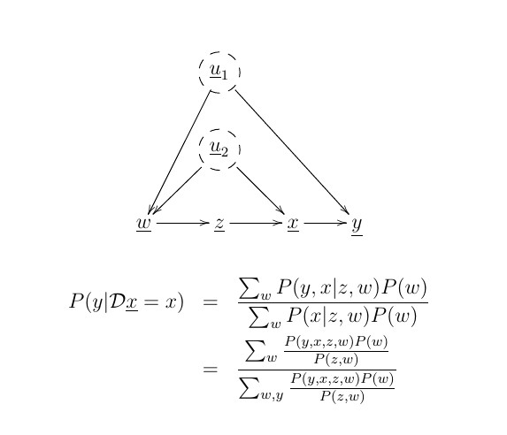

# Napkin Problem in Judea Pearl's BookOfWhy

The widely accepted 
Adjustment Formula (AF)
for the Napkin Problem in the BookOfWhy,
is as follows:

We evaluate this AF for random probabilities,
and find  
the not widely known result that
it simplifies to

P(y|do(x)) = P(y|x)

So the accepted AF seems overly complicated.
See the
[this](https://github.com/rrtucci/napkin-do-calc/blob/master/napkin1.ipynb)
notebook for the details.

ADDENDUM: A more recent github repo  
that is a superset of this repo can be found 
here: [dag_iden_detector](https://github.com/rrtucci/dag_iden_detector)
